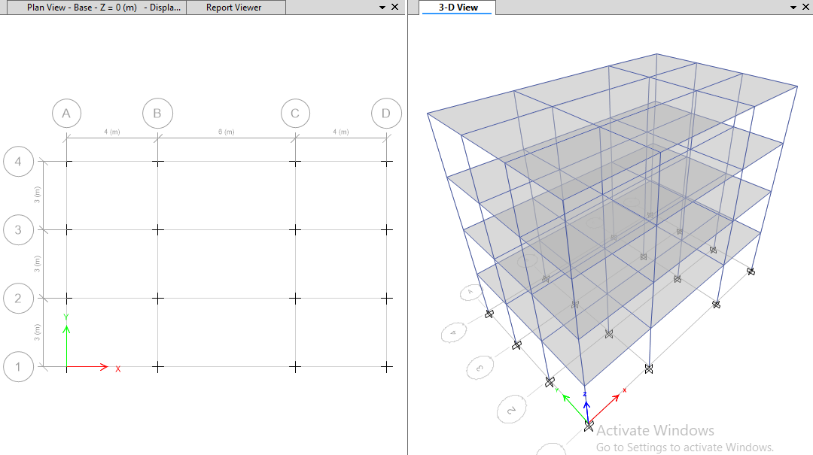
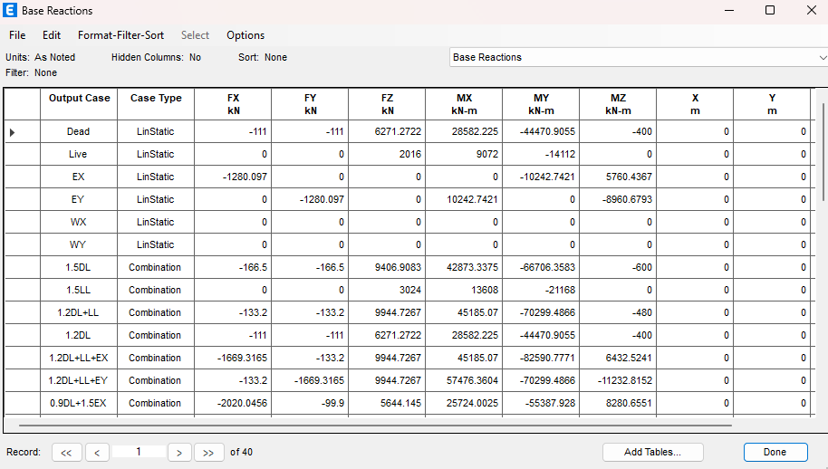

# G+3 RCC Building Design using ETABS

ETABS Modeling, Analysis and RCC Design of G+3 Residential Building as per IS 456:2000

## 📌 Project Overview
This project involves modelling, analysis and design of a G+3 reinforced concrete building using ETABS software.

## 🛠 Software Used
- ETABS 20

## 📚 Design Codes
- IS 456:2000 (Plain and Reinforced Concrete)
- IS 1893 (Part 1) – Seismic Analysis

## 🏗 Building Details
- Structure Type: RCC Framed Structure
- Number of Stories: G+3
- Storey Height: 3 m
- Total Height: 12 m

## ⚖ Loads Considered
- Dead Load (DL)
- Live Load (LL)
- Seismic Load (EX, EY)

## 🔢 Load Combinations
- 0.9DL + 1.5EX
- 0.9DL + 1.5EY
- 1.2DL + 1.2LL + 1.2EX
- 1.2DL + 1.2LL + 1.2EY

## 📊 Key Results
- Maximum Story Displacement: 20.79 mm
- Permissible Drift Limit: H/500 = 24 mm
- Drift Condition: SAFE
- PMM Interaction Ratio: Less than 1.0 (All columns safe)
  
## ✅ Conclusion
The structure satisfies drift requirements and strength requirements as per IS codes. All columns and beams are within safe limits.

## 📸 Project Screenshots

### Undeformed Shape

### Deformed Shape

### Max Story Displacement

### Base Reaction

### Column PMM Interaction Ratio

## 👨‍💻 Author
Ashmitha Vemula  
B.Tech Civil Engineering

---

📁 Detailed calculations and results are available in the attached project report PDF.
